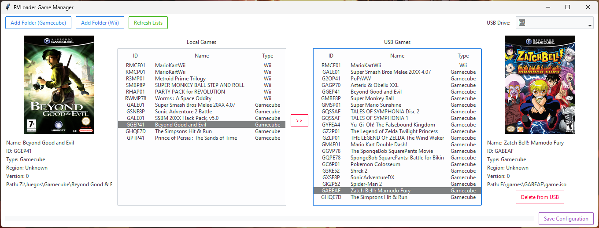

# RVmanager – A Game Transfer Utility for RVloader



## Table of Contents

- [RVmanager – A Game Transfer Utility for RVloader](#rvmanager--a-game-transfer-utility-for-rvloader)
  - [Table of Contents](#table-of-contents)
  - [Overview](#overview)
  - [Features](#features)
  - [Installation](#installation)
  - [Usage](#usage)
  - [Configuration](#configuration)
  - [USB Structure](#usb-structure)
  - [Known Bugs and Future Updates](#known-bugs-and-future-updates)
    - [Known Bugs](#known-bugs)
    - [Future Updates](#future-updates)
  - [Credits and Thanks](#credits-and-thanks)
  - [License](#license)
    - [Disclaimer:](#disclaimer)

## Overview

RVmanager is a Python-based application designed to simplify the transfer and management of Wii and Gamecube games from your computer to a USB drive, ensuring they are placed in the correct folder structure for RVloader. This tool helps you easily manage local games, copy them to USB, and keep your game library organized.

## Features

- **Graphical User Interface (GUI):** Built with Ttkbootstrap for a clean, modern look.
- **Game Scanning:** Automatically detects `.iso` or `.wbfs` files in specified folders.
- **Correct Folder Structure:** Copies Wii and Gamecube games into the right folders for RVloader (`wbfs` for Wii, `games` for Gamecube).
- **USB Drive Management:** Select and manage multiple USB drives (Windows/Linux).
- **Cover Downloads:** Automatically fetches cover images from GameTDB.
- **Configurable Paths:** Add or remove folders for both Wii and Gamecube libraries.
- **Background Copying:** Prevents UI freezes by copying games in a separate thread.
- **Deletion from USB:** Easily remove unwanted games from your drive.

## Installation

1. Clone the repository:

   ```bash
   git clone https://github.com/edgarburgues/RVmanager.git
   cd RVmanager
   ```

2. (Optional) Create and activate a virtual environment:

   ```bash
   python -m venv venv
   # Activate it on Windows
   venv\Scripts\activate
   # or on Linux/Mac
   source venv/bin/activate
   ```

3. Install dependencies:

   ```bash
   pip install -r requirements.txt
   ```

4. Run the application:
   ```bash
   python main.py
   ```

## Usage

1. **Launch RVmanager:**
   - Double-click the `main.py` file, or run `python main.py` in a terminal.
2. **Add Folders:**
   - Click `Add Folder (Gamecube)` or `Add Folder (Wii)` to point RVmanager to a folder containing your `.iso` or `.wbfs` files.
3. **Refresh Lists:**
   - Click `Refresh Lists` to scan the newly added folders and display the found games.
4. **Select USB Drive:**
   - Plug in your USB drive, then choose it from the drop-down list labeled `USB Drive`.
5. **Transfer Games:**
   - Select one or multiple games from the Local Games list, then click `>>` to copy them to the USB drive.
6. **Delete from USB:**
   - Select one or multiple games from the USB Games list, then click `Delete from USB` to remove them.

## Configuration

By default, RVmanager reads from a JSON file named `game_paths.json`.

Each entry in `"game_folders"` looks like:

```json
{
  "game_folders": [
    {
      "path": "Z:/Games/Wii",
      "type": "Wii"
    },
    {
      "path": "Z:/Games/Gamecube",
      "type": "Gamecube"
    }
  ]
}
```

When you click `Add Folder (Gamecube)` or `Add Folder (Wii)`, the chosen path gets added to this JSON.
Clicking `Save Configuration` writes the updated configuration to the JSON file.

## USB Structure

- Wii games (`ISO` or `WBFS`) are copied to:

  ```
  <USB root>/
   └── wbfs/
       └── <TitleID>.iso
  ```

- Gamecube games (`ISO`) are copied to:
  ```
  <USB root>/
   └── games/
       └── <TitleID>/
           └── game.iso
  ```

This folder structure makes your games recognizable by RVloader.

## Known Bugs and Future Updates

### Known Bugs

- **Cover Path Issue:** Currently, cover images are not being copied to the correct folder (`rvloader/covers/`), which means covers may not appear in RVloader.
- **Game Region Detection:** The region of games is always displayed as "unknown" due to incomplete metadata parsing.
- **Multidisc Handling:** Multidisc game support is partially implemented but not yet functional, requiring further development to handle these cases correctly.
- **Feedback on Transfers:** When copying a game from the PC to the USB drive, no progress feedback is shown during the process. However, upon completion, the application does indicate whether the transfer was successful or not.

### Future Updates

These issues are planned to be addressed in upcoming updates alongside other feature enhancements. Thank you for your patience and support as we work on improving RVmanager!

## Credits and Thanks

- **RVloader:** Big thanks to [Aurelio92](https://github.com/Aurelio92) for creating RVloader, the USB loader for Wii and Gamecube games that inspired this project.
- **GameTDB:** Covers are downloaded from GameTDB.

## License

This project is licensed under the GNU General Public License v3.0. You can read the full license [here](LICENSE).

### Disclaimer:

This tool is intended for managing legally owned backups of Wii and Gamecube games. You are responsible for ensuring you have the rights to any software you transfer. We are not affiliated with Nintendo, and we provide no warranty. Use at your own risk.

Thank you for using RVmanager! Enjoy transferring your game library to USB with minimal hassle and full compatibility with RVloader.
